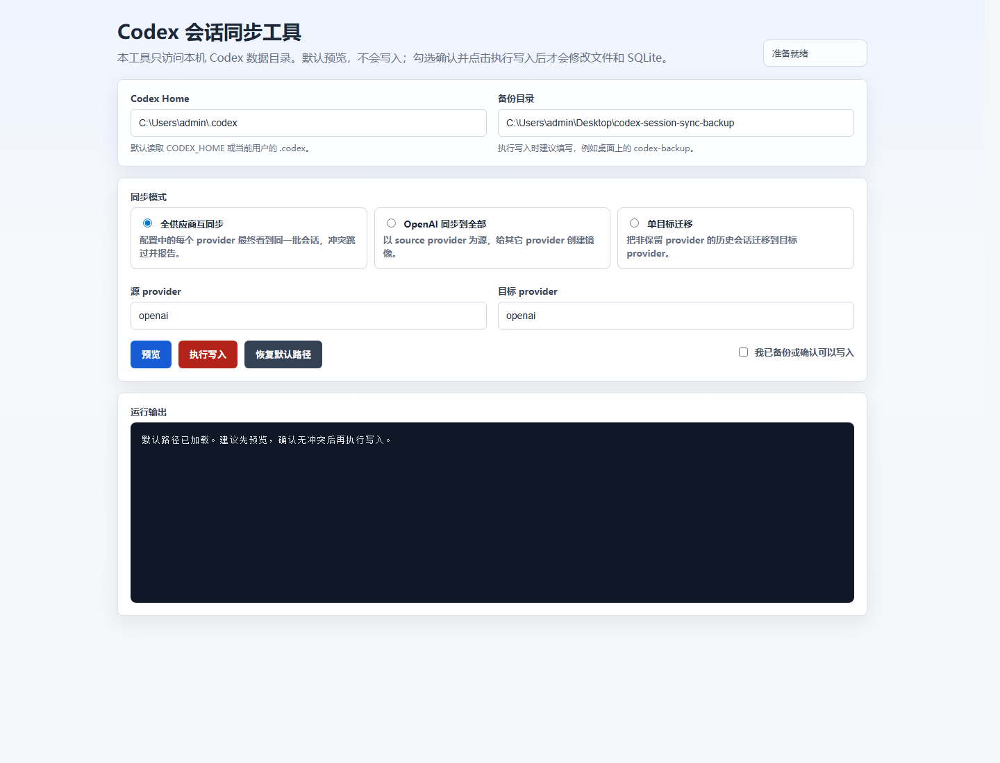

# Codex Session Sync

中文说明: [README.zh-CN.md](README.zh-CN.md)

Local utility for synchronizing Codex conversation visibility across configured model providers.

## Background

This tool was created for a common workflow with `ccswitch`: after switching Codex between multiple model providers, each provider's conversation history can appear separated from the others. That makes it inconvenient to move between providers while keeping the same project context visible.

Codex Session Sync solves that by creating provider-specific mirror sessions, so all configured providers can see the same conversation set. The implementation was also informed by the session-management tooling in `ccswitch`.

## UI Preview



## Files

- `src/m.py`: core CLI script.
- `src/m_webui.py`: local Web UI wrapper.
- `assets/ui-screenshot.png`: Web UI screenshot used by this README.
- `dist/CodexSessionSync.exe`: packaged Windows executable.
- `CodexSessionSync.spec`: PyInstaller build spec.
- `build/`: PyInstaller build cache, safe to regenerate.

## Use The Web UI

Run:

```python
python src\m_webui.py
```

The executable opens a local browser page on `127.0.0.1`. The default action is preview only. Use a backup directory and explicit apply confirmation before writing changes.

## Use The CLI

Preview mutual provider synchronization:

```powershell
python .\src\m.py --sync-all-providers-mutually
```

Apply mutual provider synchronization:

```powershell
python .\src\m.py --sync-all-providers-mutually --backup-dir .\backup --apply
```

Other supported modes:

```powershell
python .\src\m.py --sync-openai-to-all-providers
python .\src\m.py --target-provider openai
```

## Rebuild The EXE

From this directory:

```powershell
python -m PyInstaller --clean --noconfirm .\CodexSessionSync.spec
```

The rebuilt executable will be written to `dist/CodexSessionSync.exe`.

## Safety Notes

- Preview first.
- Back up before `--apply`.
- Existing conflicting mirror files or SQLite rows are skipped and reported, not overwritten.
- The mutual sync mode uses providers configured in `config.toml` and does not treat generated mirror sessions as new sources.
